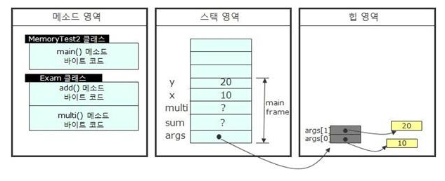
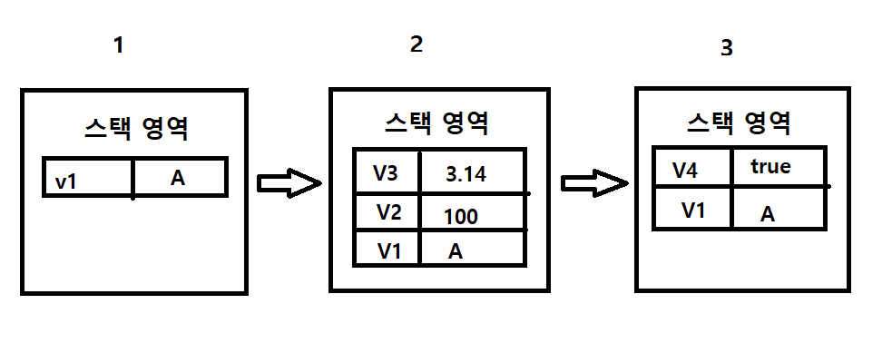
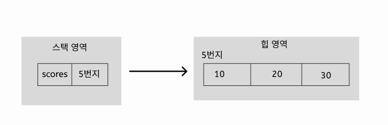
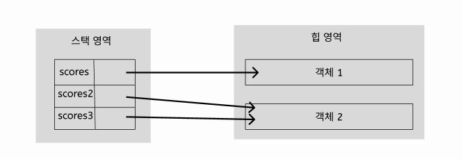

## 참조타입

### 1. 참조타입과 참조 변수

---

#### 참조타입

* 기본 타입 : 
  * byte, char, short, int, long, float, double, boolean 변수는 `실제 값`을 변수에 저장
* 참조타입 : 
  * 배열, 열거, 클래스, 인터페이스 변수는 `메모리의 번지`를 변수 안에 저장. 
  * 번지를 통해 객체를 참조한다는 뜻에서 참조 타입이라 불림

---

#### 메모리 사용 영역



##### 메소드 영역

* JVM이 시작할 때 생성되고, 모든 스레드가 공유하는 영역
* 사용되는 클래스들을 클래스 로더로 읽어 클래스별로 정적 필드와 상수, 메소드 코드, 생성자 코드 등을 분류해서 저장

##### 힙영역

* 객체와 배열이 생성되는 영역, 생성된 객체와 배열은 JVM 스택 영역의 변수나 다른 객체 필드에서 참조
* 만일 참조하는 변수나 필드가 없다면, 쓰레기로 취급하여 `Garbage Collector`를 실행시켜 자동으로 제거

##### JVM 스택영역

* 메소드를 호출할 때마다 프레임을 추가하고 메소드가 종료되면 해당 프레임을 제거하는 동작 수행
* 프레임 내부에는 로컬 변수 스택이 있는데, 기본 타입 변수와 참조 타입 변수가 추가되거나 제거된다.
* 스택 영역에 변수가 생성되는 시점은 초기화될 때, 즉 값이 저장될 때. 변수는 선언된 블록 안에서만 존재하고 블록을 벗어나면 스택에서 제거된다.

```java
char v1 = 'A';			// 1

if(v1=='A'){			// 2
    int v2 = 100;
    double v3 = 3.14;
}

boolean v4 = true;		// 3
```



다음과 같이 실행 순서에 따라 스택에 생성이 되고, if문을 빠져나가는 3번의 순간 v2와 v3는 사라지게 된다.

위는 기본 타입 변수로서 스택 영역에 직접 값을 가지고 있지만, 참조 타입변수는 힙 영역의 객체 주소를 가지게 된다.

예시는 다음과 같다

```java
int[] scores = {10, 20, 30};
```



---

#### 참조 변수의 `==`, `!=` 연산

* 기본 타입 변수의 `==`,`!=`는 변수의 값이 같은지 아닌지 조사

* 참조 타입의 연산은 동일한 객체를 참조하는지, 다른 객체를 참조하는지 조사(번지 값을 비교)

  

```java
scores == scores2 // false;
scores2 == scores3 // true;
```

---

#### null과 NullPointerException

* 참조 타입 변수는 힙 영역의 객체를 참조하지 않는다는 뜻으로 `null`값을 가질 수 있다.(null로도 초기화가 가능하다)

※ 예외란? => 프로그램 실행 도중에 발생하는 오류.

```java
사용자의 오입력으로도 발생 가능
프로그래머가 코드를 잘못 작성해서 발생할 수도 있음
그 중 참조 변수를 사용하면서 가장 많이 발생하는 예외중 하나로 `NullPointerException`이 있다.
참조 변수가 null을 가지고 있을 경우, 참조 객체가 없으므로 변수를 통해 객체를 사용할 수 없는데,
이 때 해당 참조 변수를 사용하는 코드를 실행할 경우 발생한다. 
    
int[] intArray = null;
intArray[0] = 10; // NullPointerException 발생
```

---

#### String타입

* 문자열이 String 객체로 생성되고 변수는 String 객체를 참조하게 된다.
* 이때, 자바에서는 문자열 리터럴이 동일하다면 동일한 String 객체를 공유하게 된다.
* `new` 연산자를 통해서 같은 리터럴을 가진 객체를 생성하더라도 서로 다른 객체를 참조하게 된다. 

```java
String name1 = "신용권";
String name2 = "신용권"; 
// 모두 같은 객체를 참조하게 됨


String name1 = new String("신용권");
String name2 = new String("신용권");
// 같은 문자열 리터럴이라도 다른 객체를 참조하게 됨

// 다만 객체 참조가 아닌, 값 비교를 위해서는 equals를 통해 비교할 수 있다
```

```java
package sec01.exam01;

public class StringEqualsExample {

	public static void main(String[] args) {
		String strVar1 = "신민철";
		String strVar2 = "신민철";
		
		if(strVar1 == strVar2) {
			System.out.println("strVar1과 strVar2는 참조가 같음");
		} else {
			System.out.println("strVar1과 strVar2는 참조가 다름");
		}
		
		if(strVar1.equals(strVar2)) {
			System.out.println("strVar1과 strVar2의 문자열이 같음");
		}
		String strVar3 = new String("신민철");
		String strVar4 = new String("신민철");
		if(strVar3 == strVar4) {
			System.out.println("strVar3과 strVar4는 참조가 같음");
		} else {
			System.out.println("strVar3과 strVar4는 참조가 다름");
		}
		
		if(strVar1.equals(strVar2)) {
			System.out.println("strVar1과 strVar2의 문자열이 같음");
		}
	}
}
/*
strVar1과 strVar2는 참조가 같음
strVar1과 strVar2의 문자열이 같음
strVar3과 strVar4는 참조가 다름
strVar1과 strVar2의 문자열이 같음
*/
```

---

### 2.  배열

* 같은 타입의 데이터를 연속된 공간에 나열하고, 각 데이터에 인덱스를 부여해 놓은 자료구조
* 한 번 생성된 배열은 길이를 늘리거나 줄일 수 없다.

#### 1. 배열선언

```java
형식 1
타입[] 변수;

int[] intArray;
double[] doubleArray;

형식 2
타입 변수[];

int intArray[];
double doubleArray[];
```

---

#### 2. 배열 생성

##### 값 목록으로 배열 생성

```java
package sec02.exam01;

public class ArrayCreateByValueListExample1 {

	public static void main(String[] args) {
		int[] scores = {83, 90, 87};
		
		System.out.println("scores[0]: " + scores[0]);
		System.out.println("scores[1]: " + scores[1]);
		System.out.println("scores[2]: " + scores[2]);
		
		int sum = 0;
		for(int i=0; i<3; i++) {
			sum += scores[i];
		}
		System.out.println("총합: " + sum);
		double avg = (double)sum/3;
		System.out.println("평균: " + avg);
		}
}
/*
scores[0]: 83
scores[1]: 90
scores[2]: 87
총합: 260
평균: 86.66666666666667
*/
```

```java
package sec02.exam01;

public class ArrayCreateByValueListExample2 {

	public static void main(String[] args) {
		int[] scores;
		scores = new int[] {83, 90, 87};
		int sum1 = 0;
		for(int i=0; i<3; i++) {
			sum1 += scores[i];
		}
		System.out.println("총합: " + sum1);
		
		int sum2 = add( new int[] {83, 90, 87});
		System.out.println("총합: " + sum2);
		System.out.println();
	}
	
	public static int add(int[] scores) {
		int sum = 0;
		for(int i=0; i<3; i++) {
			sum += scores[i];
		}
		return sum;
	}
}
/*
총합: 260
총합: 260
*/
```

---

##### new 연산자로 배열 생성

값의 목록을 가지고 있지 않지만, 향후 값들을 저장할 배열을 미리 만들고 싶다면 new 연산자로 객체 생성이 가능하다.

```java
타입[] 변수 = new 타입[길이];
```

new 연산자로 배열을 처음 생성할 경우 자동으로 기본값으로 구성되어 있다. 

|      분류       |                          타입                          |                초기값                 |
| :-------------: | :----------------------------------------------------: | :-----------------------------------: |
| 기본 타입(정수) | byte[]<br />char[]<br />short[]<br />int[]<br />long[] | 0<br />'\u0000'<br />0<br />0<br />0L |
| 기본 타입(실수) |                 float[]<br />double[]                  |             0.0F<br />0.0             |
| 기본 타입(논리) |                       boolean[]                        |                 false                 |
|    참조 타입    |               클래스[]<br />인터페이스[]               |            null<br />null             |

```java
package sec02.exam03;

public class ArrayCreateByNewExample {

	public static void main(String[] args) {
		int[] arr1 = new int[3];
		for(int i=0;i<3;i++) {
			System.out.println("arr1[" + i + "] : " + arr1[i] );
		}
		arr1[0] = 10;
		arr1[1] = 20;
		arr1[2] = 30;
		for(int i=0; i<3; i++) {
			System.out.println("arr1[" + i + "] : " + arr1[i] );
		}
		
		double[] arr2 = new double[3];
		for(int i=0;i<3;i++) {
			System.out.println("arr2[" + i + "] : " + arr2[i] );
		}
		arr2[0] = 0.1;
		arr2[1] = 0.2;
		arr2[2] = 0.3;
		for(int i=0; i<3; i++) {
			System.out.println("arr2[" + i + "] : " + arr2[i] );
		}	
	
	}
}
/*
arr1[0] : 0
arr1[1] : 0
arr1[2] : 0
arr1[0] : 10
arr1[1] : 20
arr1[2] : 30
arr2[0] : 0.0
arr2[1] : 0.0
arr2[2] : 0.0
arr2[0] : 0.1
arr2[1] : 0.2
arr2[2] : 0.3
*/
```

---

#### 3. 배열길이 `배열변수.length`

```java
package sec02.exam04;

public class ArrayLengthExample {

	public static void main(String[] args) {
		int[] scores = {83, 90, 87};
		
		int sum = 0;
		for(int i=0;i<scores.length;i++) {
			sum += scores[i];
		}
		System.out.println("총합: "+ sum);
		
		double avg = (double)sum/scores.length;
		System.out.println("평균: " + avg);
	}
}
/*
총합: 260
평균: 86.66666666666667
*/
```

---

#### 4. 명령 라인 입력

```java
package sec02.exam05;

public class MainStringArrayArgument {

	public static void main(String[] args) {
		if(args.length != 2) {
			System.out.println("값의 수가 부족합니다.");
			System.exit(0); // 프로그램 종료
		}
		
		String strNum1 = args[0];
		String strNum2 = args[1];
		
		int num1 = Integer.parseInt(strNum1);
		int num2 = Integer.parseInt(strNum2);
		
		int result = num1 + num2;
		System.out.println(result);
		
	}
}
/*
10 20 입력시
30
*/
```

---

#### 5. 다차원배열

행과 열로서 구성된 배열

```java
타입[][] 변수 = {{값1, 값2}, {값1, 값2, 값3}};
```

```java
package sec02.exam06;

public class ArrayInArrayExample {

	public static void main(String[] args) {
		
		int[][] mathScores = new int[2][3];
		for(int i=0;i<mathScores.length;i++) {
			for(int j=0;j<mathScores[i].length;j++) {
				System.out.println("mathscores[" + i + "][" + j+ "] = " + mathScores[i][j]);
			}
		}
		
		System.out.println();
		
		int[][] englishScores = new int[2][];
		englishScores[0] = new int[2];
		englishScores[1] = new int[3];
		for(int i=0;i<englishScores.length;i++) {
			for(int j=0;j<englishScores[i].length;j++) {
				System.out.println("englishScores[" + i + "][" + j+ "] = " + englishScores[i][j]);
			}
		}
		
		System.out.println();
		
		int[][] javaScores = {{95, 80}, {92, 96, 80}};
		for(int i=0;i<javaScores.length;i++) {
			for(int j=0;j<javaScores[i].length;j++) {
				System.out.println("javaScores[" + i + "][" + j+ "] = " + javaScores[i][j]);
			}
		}
		
	}
}
/*
mathscores[0][0] = 0
mathscores[0][1] = 0
mathscores[0][2] = 0
mathscores[1][0] = 0
mathscores[1][1] = 0
mathscores[1][2] = 0

englishScores[0][0] = 0
englishScores[0][1] = 0
englishScores[1][0] = 0
englishScores[1][1] = 0
englishScores[1][2] = 0

javaScores[0][0] = 95
javaScores[0][1] = 80
javaScores[1][0] = 92
javaScores[1][1] = 96
javaScores[1][2] = 80
*/
```

---

#### 6. 객체를 참조하는 배열

기본타입은 배열의 각 항목에 값을 가지고 있지만, 참조 타입의 경우 각 항목에 객체의 번지를 가지고 있다. 즉 값을 비교하기 위해서는 `==`이 아닌 `equals`를 사용해야 한다.

```java
package sec02.exam07;

public class ArrayReferenceObjectExample {

	public static void main(String[] args) {
		String[] strArray = new String[3];
		strArray[0] = "JAVA";
		strArray[1] = "JAVA";
		strArray[2] = new String("JAVA");
		
		System.out.println( strArray[0] == strArray[1]);
		System.out.println( strArray[0] == strArray[2]);
		System.out.println( strArray[0].equals(strArray[2]));
	}
}
/*
true
false
true
*/
```

---

#### 7. 배열 복사

한 번 생성하면 크기를 변경할 수 없기 때문에, 더 많은 저장 공간이 필요하다면 더 큰 배열을 새로 만들고, 이전 배열로부터 항목 값들을 복사해야한다. 

복사된 배열의 항목은 이전 배열의 항목이 참조하는 객체와 동일하다.

`for`문을 사용하거나 System.arraycopy() 메소드를 사용한다.

* `for문`으로 복사

``` java
package sec02.exam08;

public class ArrayCopyByForExample {

	public static void main(String[] args) {
		int[] oldArray = {1,2,3};
		int[] newArray = new int[5];
		
		for(int i=0;i<oldArray.length;i++) {
			newArray[i] = oldArray[i];
		}
		
		for(int i=0;i<newArray.length;i++) {
			System.out.print(newArray[i] + ",");
		}
	}
}
// 1,2,3,0,0,
```

* `System.arraycopy()`사용

```java
package sec02.exam08;

public class ArrayCopyExample {

	public static void main(String[] args) {
		String[] oldArray = {"java", "array", "copy"};
		String[] newArray = new String[5];
		
		System.arraycopy(oldArray, 0, newArray, 0, oldArray.length);
		
		for(int i=0;i<newArray.length;i++) {
			System.out.print(newArray[i] + ",");
		}
	}
}
// java,array,copy,null,null,
```

---

#### 8. 향상된 for문

향상된 for문은 루프 카운터 변수와 증감식을 사용하지 않는다.

for문의 괄호에는 배열에서 꺼낸 항목을 저장할 변수 선언과 콜론, 그리고 배열을 나란히 작성한다

```java
package sec02.exam10;

public class AdvancedForExample {

	public static void main(String[] args) {
		int[] scores = {95, 71, 84, 93, 87};
		
		int sum = 0;
		for(int score : scores) {
			sum += score;
		}
		System.out.println("총함 : " + sum);
		
		double avg = (double)sum/scores.length;
		System.out.println("평균 : " + avg);
	}
}
/*
총함 : 430
평균 : 86.0
*/
```

---

### 3. 열거 타입

한정된 값만을 갖는 타입

```java
// Week.java

public enum Week{ 			// week는 열거 타입 이름
    MONDAY,
    TUESDAY,
    WEDNESDAY,				// 요일들은 열거 상수
    THURSDAY,
    FRIDAY,
    SATURDAY,
    SUNDAY
}

Week today;
today = Week.FRIDAY;
와 같이 선언 및 저장할 수 있다
```

---

#### 열거 타입 선언

1. 열거 타입의 이름을 정하고, 해당 이름으로 소스파일(.java)을 생성해야한다.

   * 이름은 첫글자 대문자가 국룰, 여러 단어일 경우 첫 시작 대문자

   * ```
     Week.java
     ProductKind.java
     ```

2. `public enum 열거타입이름 {...}` 을 활용하는데 이때 소스파일과 열거타입 이름은 대소문자 모두 같아야한다.

3. 관례적으로 열거 상수는 모두 대문자로 작성한다

   * 이때, 열거 상수가 여러 단어로 이루어져 있는 경우 밑줄로 연결한다

   * ```java
     public enum LoginResult {LOGIN_SUCCESS, LOGIN_FAILED}
     ```

```java
package sec03;

public enum Week {
	MONDAY,
	TUESDAY,
	WEDNESDAY,
	THURSDAY,
	FRIDAY,
	SATURDAY,
	SUNDAY
}
```

---

#### 열거 타입 변수

1. 열거 타입을 선언했다면 열거 타입 변수를 선언하고 사용해야한다.

   * ```java
     Week today;
     Week reservationDay;
     
     // 열거타입 변수; 의 형태
     ```

2. 열거 타입 변수를 선언했다면 열거 상수를 저장 가능하다.

   * 열거 상수는 단독으로 사용할 수 없으며 반드시 `열거타입.열거상수` 형태로 사용된다

   * 열거 타입도 참조 타입이기 때문에 null값을 저장할 수 있다, 즉 열거 상수도 객체

   * ```java
     Week today = Week.SUNDAY;
     Week birthday = null;
     ```

3.  다음 코드 해석

   ```
   Week today = Week.SUNDAY;
   
   열거타입변수 today는 스택에 생성되고, today에 저장되는 값은 SUNDAY가 바라보고 있는 참조 주소이다. 즉
   today == Week.SUNDAY; 의 경우 true가 결과값이다.
   ```

   ```java
   package sec03.exam02;
   
   import java.util.Calendar;
   
   public enum Week {
   	MONDAY,
   	TUESDAY,
   	WEDNESDAY,
   	THURSDAY,
   	FRIDAY,
   	SATURDAY,
   	SUNDAY
   }
   
   
   public class EnumWeekExample {
   
   	public static void main(String[] args) {
   		Week today = null;
   		
   		Calendar cal = Calendar.getInstance();
   		int week = cal.get(Calendar.DAY_OF_WEEK);
   		
   		switch(week) {
   		case 1:
   			today = Week.SUNDAY; break;
   		case 2:
   			today = Week.MONDAY; break;
   		case 3:
   			today = Week.TUESDAY; break;
   		case 4:
   			today = Week.WEDNESDAY; break;
   		case 5:
   			today = Week.THURSDAY; break;
   		case 6:
   			today = Week.FRIDAY; break;
   		case 7:
   			today = Week.SATURDAY; break;
   		}
   		
   		System.out.println("오늘 요일: " + today);
   		
   		if(today == Week.SUNDAY) {
   			System.out.println("일요일에는 축구를 합니다");
   		} else {
   			System.out.println("열심히 자바 공부를 합니다");
   		}
   	}
   }
   ```

   

